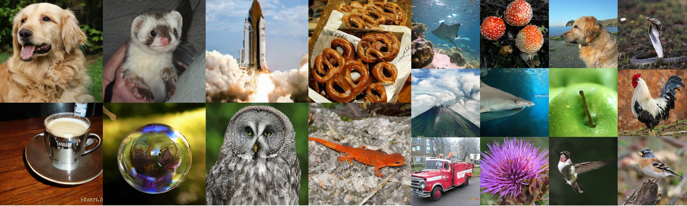

# [ICML 2026] Scalable GANs with Transformers

[](https://hse1032.github.io/GAT)
[](https://arxiv.org/abs/2509.24935)



Generative Adversarial Transformers (GAT) scale GANs with pure transformer
generators and discriminators trained in a compact VAE latent space. GAT is
designed for one-step class-conditional image generation and studies how GANs
scale with model capacity, tokenization choices, and compute.

The method addresses key scaling issues in transformer GANs with Multi-level
Noise-perturbed image Guidance (MNG), which improves intermediate generator
layer utilization, and width-aware learning-rate scaling, which stabilizes
optimization as models grow.

The code supports `GAT-S`, `GAT-B`, `GAT-L`, and `GAT-XL` variants with patch
sizes `/2`, `/4`, and `/8`.

## Installation

Create an environment and install the requirements.

```bash
cd GAT_codes
conda create -n gat python=3.10 -y
conda activate gat
pip install -r requirements.txt
```

Install a PyTorch build that matches your CUDA version if the default `torch`
package is not suitable for your machine.

Configure Accelerate before multi-GPU training.

```bash
accelerate config
```

## Pretrained Checkpoints

Pretrained checkpoints will be released here:

```text
https://huggingface.co/your-org/gat/resolve/main/gat_b2_256.pt
```

## Dataset

`train.py` expects a dataset directory with images, VAE latents, and labels.

```text
DATA_DIR/
  images/
    ...
  vae-sd/
    ...
    dataset.json
  VIRTUAL_imagenet256_labeled.npz
```

`images/` stores raw images. `vae-sd/` stores matching Stable Diffusion VAE
latent `.npy` files. `vae-sd/dataset.json` should contain labels indexed by the
latent file names, following this shape:

```json
{
  "labels": [
    ["relative/path/to/sample.npy", 0]
  ]
}
```

The optional `VIRTUAL_imagenet{resolution}_labeled.npz` file is used for FID
during training. It should contain ADM-style reference statistics, including
`mu` and `sigma`.

Dataset preprocessing and VAE latent preparation follow the REPA codebase:

```text
https://github.com/sihyun-yu/REPA
```

## Training

Edit paths and GPU settings in `scripts/train_256_B2.sh`, then launch:

```bash
cd GAT_codes
bash scripts/train_256_B2.sh
```

Equivalent direct launch:

```bash
accelerate launch train.py \
  --model GAT-B/2 \
  --modelD GAT-B/2 \
  --resolution 256 \
  --data-dir /path/to/DATA_DIR \
  --output-dir exps \
  --exp-name gat_b2_256 \
  --batch-size 512 \
  --learning-rate 2e-4 \
  --enc-type dinov2-vit-b \
  --mixed-precision bf16 \
  --allow-tf32
```

Checkpoints are written under:

```text
OUTPUT_DIR/EXP_NAME/checkpoints/
```

Use `--resume-step -1` to resume from `latest.pt`, or pass a positive step to
load a numbered checkpoint.

## Inference

Generate samples from a checkpoint and save both PNG files and an `.npz` archive
for evaluation.

```bash
cd GAT_codes
torchrun --standalone --nproc_per_node=1 generate.py \
  --ckpt /path/to/checkpoints/latest.pt \
  --sample-dir samples \
  --num-fid-samples 50000 \
  --per-proc-batch-size 32
```

For multi-GPU inference, increase `--nproc_per_node`.

```bash
torchrun --standalone --nproc_per_node=8 generate.py \
  --ckpt /path/to/checkpoints/latest.pt \
  --sample-dir samples \
  --num-fid-samples 50000 \
  --per-proc-batch-size 32
```

## Evaluation

This code follows the ADM evaluation style: generate an `.npz` file of samples
and compare it against dataset reference statistics. See the ADM repository for
the canonical evaluation protocol and scripts:

```text
https://github.com/openai/guided-diffusion/tree/main/evaluations
```

The generated sample archive is saved next to the PNG sample folder:

```text
samples/<run-name>.npz
```
